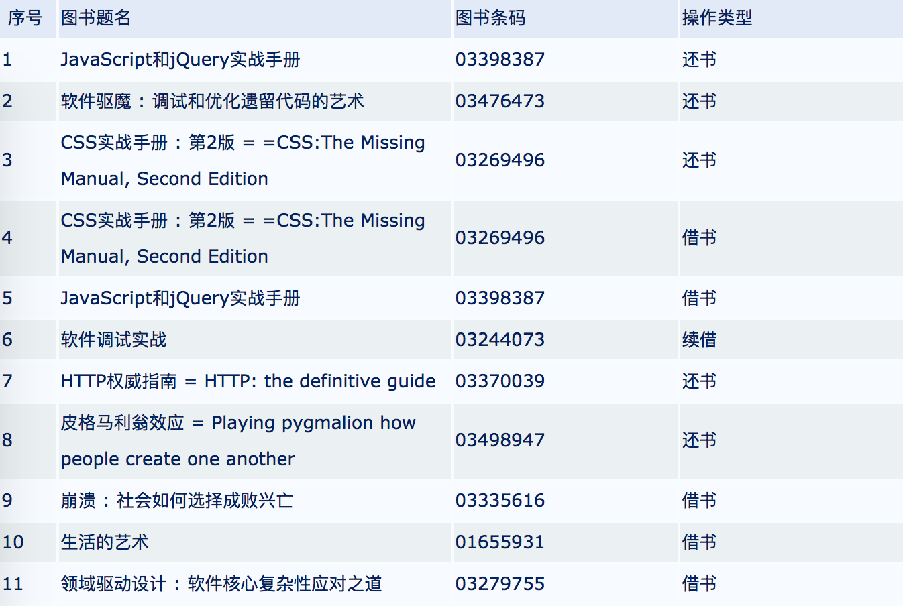
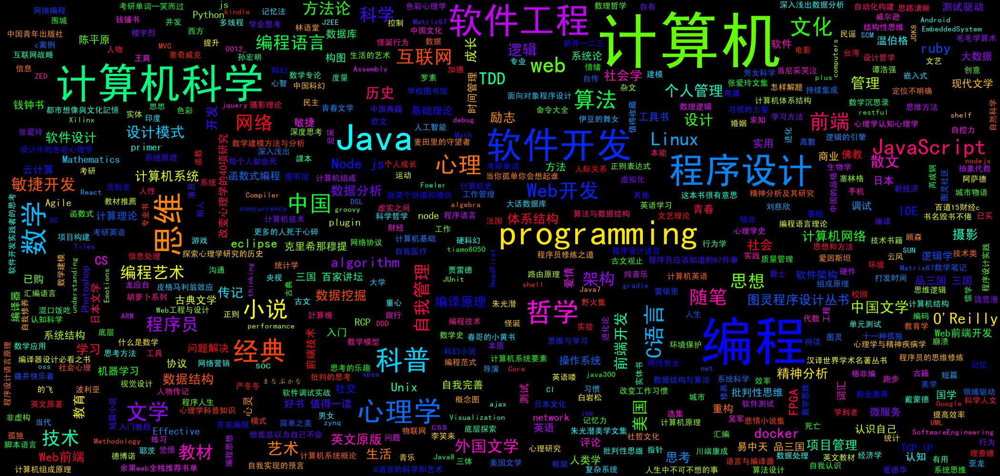

# college-book-history-analysis
作用：分析大学期间读过的书

使用 `parse.py` 提取出个人图书馆读书记录页面的所有读书记录

```javascript
{
    "name": "JavaScript和jQuery实战手册",
    "number": "1",
    "operation": "还书",
    "code": "03398387"
  },
  {
    "name": "软件驱魔 : 调试和优化遗留代码的艺术",
    "number": "2",
    "operation": "还书",
    "code": "03476473"
  },
  {
    "name": "CSS实战手册 : 第2版 = =CSS:The Missing Manual, Second Edition",
    "number": "3",
    "operation": "还书",
    "code": "03269496"
  },
  {
    "name": "CSS实战手册 : 第2版 = =CSS:The Missing Manual, Second Edition",
    "number": "4",
    "operation": "借书",
    "code": "03269496"
  },
  {
    "name": "JavaScript和jQuery实战手册",
    "number": "5",
    "operation": "借书",
    "code": "03398387"
  }
  
  ...
```

使用 `getTags.js` 获取读书记录的豆瓣标签

```javascript
{count: 38, name: 'web开发', title: 'web开发'},
  {count: 35, name: '前端', title: '前端'},
  {count: 30, name: 'Web前端', title: 'Web前端'},
  {count: 24, name: '前端开发', title: '前端开发'},
  {count: 20, name: 'web', title: 'web'},
  {count: 12, name: 'css', title: 'css'},
  {count: 7, name: '计算机', title: '计算机'},
  {count: 9, name: 'JavaScript', title: 'JavaScript'},
  {count: 6, name: '前端', title: '前端'},
  {count: 4, name: 'web', title: 'web'},
  {count: 4, name: 'jquery', title: 'jquery'},
  {count: 3, name: '计算机', title: '计算机'},
  {count: 3, name: '前端开发', title: '前端开发'},
  {count: 2, name: 'kindle', title: 'kindle'},
  {count: 2, name: 'Web', title: 'Web'},
  {count: 1248, name: '社会学', title: '社会学'},
  {count: 671, name: '贾雷德·戴蒙德', title: '贾雷德·戴蒙德'},
  {count: 438, name: '环境', title: '环境'},
  {count: 419, name: '人类学', title: '人类学'},
  {count: 416, name: '社会', title: '社会'},
  {count: 341, name: '历史', title: '历史'},
  {count: 236, name: '环境保护', title: '环境保护'},
  {count: 218, name: '"崩溃"', title: '"崩溃"'},
  {count: 1947, name: '林语堂', title: '林语堂'},
  {count: 853, name: '生活的艺术', title: '生活的艺术'},
  {count: 707, name: '随笔', title: '随笔'},
  {count: 641, name: '散文', title: '散文'},
  
  ...
```

使用 `buildWordCloud.py` 根据豆瓣标签生成 *词云* 
